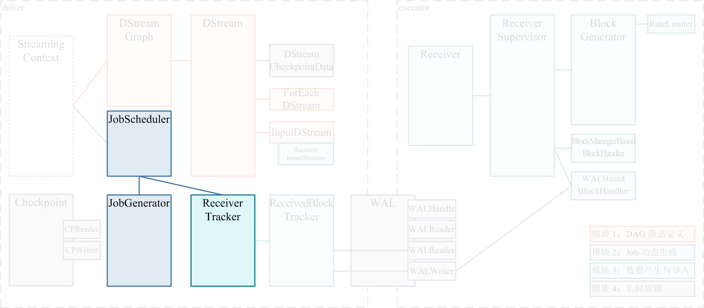
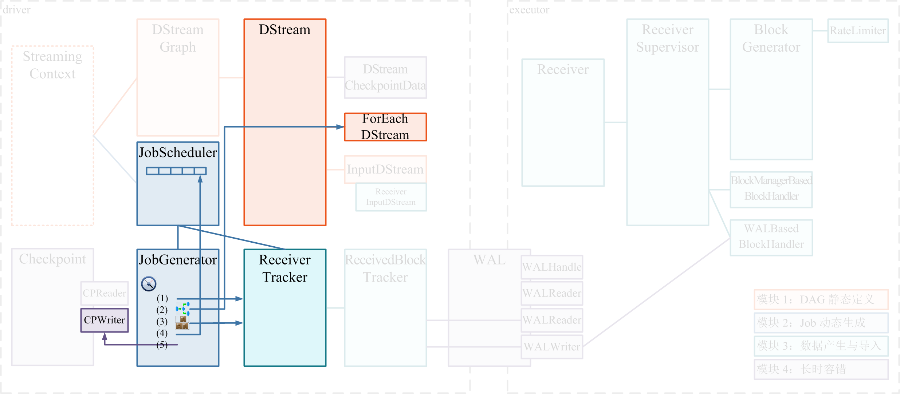
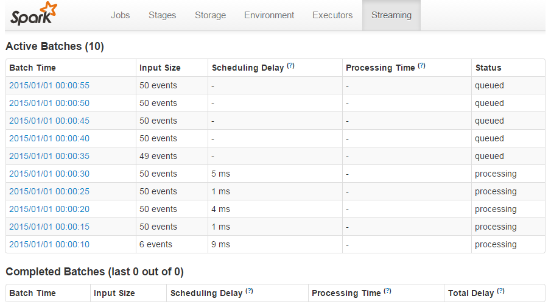
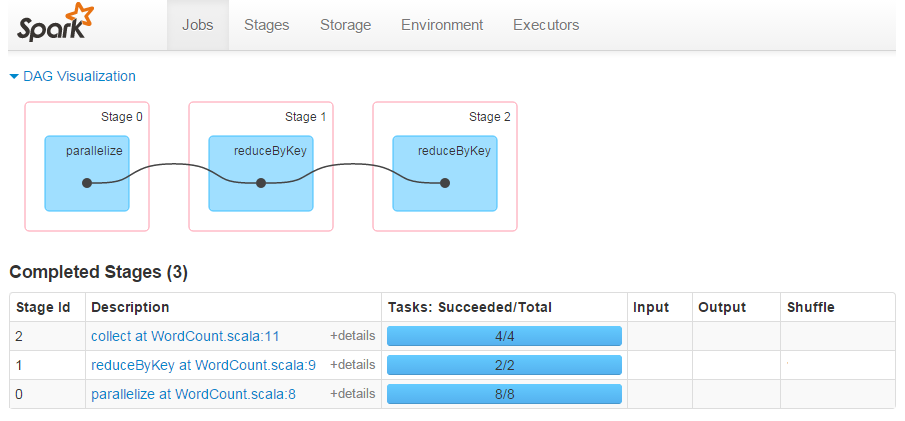

# JobScheduler, Job, JobSet 详解 #

***[酷玩 Spark] Spark Streaming 源码解析系列*** ，返回目录请 [猛戳这里](readme.md)

[「腾讯·广点通」](http://e.qq.com)技术团队荣誉出品

*本文内容适用范围：*

- *2016.07.26 update, Spark 2.0 全系列 √ (2.0.0)*
- *2016.03.10 update, Spark 1.6 全系列 √ (1.6.0, 1.6.1)*
- *2015.11.09 update, Spark 1.5 全系列 √ (1.5.0, 1.5.1, 1.5.2)*
- *2015.07.15 update, Spark 1.4 全系列 √ (1.4.0, 1.4.1)*
<br/>
<br/>

阅读本文前，请一定先阅读 [Spark Streaming 实现思路与模块概述](0.1 Spark Streaming 实现思路与模块概述.md) 一文，其中概述了 Spark Streaming 的 4 大模块的基本作用，有了全局概念后再看本文对 `模块 2：Job 动态生成` 细节的解释。

## 引言

前面在 [Spark Streaming 实现思路与模块概述](0.1 Spark Streaming 实现思路与模块概述.md) 和 [DStream 生成 RDD 实例详解](1.2 DStream 生成 RDD 实例详解.md) 里我们分析了 `DStreamGraph` 和 `DStream` 具有能够实例化 `RDD` 和 `RDD` DAG 的能力，下面我们来看 Spark Streaming 是如何将其动态调度的。

在 Spark Streaming 程序的入口，我们都会定义一个 `batchDuration`，就是需要每隔多长时间就比照静态的 `DStreamGraph` 来动态生成一个 RDD DAG 实例。在 Spark Streaming 里，总体负责动态作业调度的具体类是 `JobScheduler`，在 Spark Streaming 程序在 `ssc.start()` 开始运行时，会生成一个 `JobScheduler` 的实例，并被 start() 运行起来。

```scala
// 来自 StreamingContext
def start(): Unit = synchronized {
  ...
  ThreadUtils.runInNewThread("streaming-start") {
    sparkContext.setCallSite(startSite.get)
    sparkContext.clearJobGroup()
    sparkContext.setLocalProperty(SparkContext.SPARK_JOB_INTERRUPT_ON_CANCEL, "false")
    scheduler.start()  // 【这里调用了 JobScheduler().start()】
  }
  state = StreamingContextState.ACTIVE
  ...
}
```

## Spark Streaming 的 Job 总调度者 JobScheduler

**`JobScheduler` 是 Spark Streaming 的 Job 总调度者**。

`JobScheduler` 有两个非常重要的成员：`JobGenerator` 和 `ReceiverTracker`。`JobScheduler` 将每个 batch 的 RDD DAG 具体生成工作委托给 `JobGenerator`，而将源头输入数据的记录工作委托给 `ReceiverTracker`。



    JobScheduler    的全限定名是：org.apache.spark.streaming.scheduler.JobScheduler
    JobGenerator    的全限定名是：org.apache.spark.streaming.scheduler.JobGenerator
    ReceiverTracker 的全限定名是：org.apache.spark.streaming.scheduler.ReceiverTracker

**`JobGenerator` 维护了一个定时器**，周期就是我们刚刚提到的 `batchDuration`，**定时为每个 batch 生成 RDD DAG 的实例**。
具体的，根据我们在 [DStream 生成 RDD 实例详解](1.2 DStream 生成 RDD 实例详解.md) 中的解析，`DStreamGraph.generateJobs(time)` 将返回一个 `Seq[Job]`，其中的每个 `Job` 是一个 `ForEachDStream` 实例的 `generateJob(time)` 返回的结果。



此时，`JobGenerator` 拿到了 `Seq[Job]` 后（如上图 `(2)` ），就将其包装成一个 JobSet（如上图 `(3)` ），然后就调用 `JobScheduler.submitJobSet(jobSet)` 来交付回 JobScheduler（如上图 (4) ）。

那么 `JobScheduler` 收到 `jobSet` 后是具体如何处理的呢？我们看其实现：
```scala
// 来自 JobScheduler.submitJobSet(jobSet: JobSet)
if (jobSet.jobs.isEmpty) {
  logInfo("No jobs added for time " + jobSet.time)
} else {
  listenerBus.post(StreamingListenerBatchSubmitted(jobSet.toBatchInfo))
  jobSets.put(jobSet.time, jobSet)
  // 【下面这行是最主要的处理逻辑：将每个 job 都在 jobExecutor 线程池中、用 new JobHandler 来处理】
  jobSet.jobs.foreach(job => jobExecutor.execute(new JobHandler(job)))
  logInfo("Added jobs for time " + jobSet.time)
}
```

这里最重要的处理逻辑是 `job => jobExecutor.execute(new JobHandler(job))`，也就是将每个 job 都在 jobExecutor 线程池中、用 new JobHandler 来处理。

### JobHandler

先来看 JobHandler 针对 Job 的主要处理逻辑：
```scala
// 来自 JobHandler
def run()
{
  ...
  // 【发布 JobStarted 消息】
  _eventLoop.post(JobStarted(job))
  PairRDDFunctions.disableOutputSpecValidation.withValue(true) {
    // 【主要逻辑，直接调用了 job.run()】
    job.run()
  }
  _eventLoop = eventLoop
  if (_eventLoop != null) {
  // 【发布 JobCompleted 消息】
    _eventLoop.post(JobCompleted(job))
  }
  ...
}
```

也就是说，`JobHandler` 除了做一些状态记录外，最主要的就是调用 `job.run()`！这里就与我们在 [DStream 生成 RDD 实例详解](1.2 DStream 生成 RDD 实例详解.md) 里分析的对应起来了：
在 `ForEachDStream.generateJob(time)` 时，是定义了 `Job` 的运行逻辑，即定义了 `Job.func`。而在 `JobHandler` 这里，是真正调用了 `Job.run()`、将触发 `Job.func` 的真正执行！

### Job 运行的线程池 jobExecutor

上面 `JobHandler` 是解决了做什么的问题，本节 `jobExecutor` 是解决 `Job` 在哪里做。

具体的，`jobExecutor` 是 `JobScheduler` 的成员：

```scala
// 来自 JobScheduler
private[streaming]
class JobScheduler(val ssc: StreamingContext) extends Logging {
  ...
  private val numConcurrentJobs = ssc.conf.getInt("spark.streaming.concurrentJobs", 1)
  private val jobExecutor =
      ThreadUtils.newDaemonFixedThreadPool(numConcurrentJobs, "streaming-job-executor")
  ...
}
```

也就是，`ThreadUtils.newDaemonFixedThreadPool()` 调用将产生一个名为 `"streaming-job-executor"` 的线程池，所以，`Job` 将在这个线程池的线程里，被实际执行 `func`。

## spark.streaming.concurrentJobs 参数

这里 `jobExecutor` 的线程池大小，是由 `spark.streaming.concurrentJobs` 参数来控制的，当没有显式设置时，其取值为 `1`。

进一步说，这里 `jobExecutor` 的线程池大小，就是能够并行执行的 `Job` 数。而回想前文讲解的 `DStreamGraph.generateJobs(time)` 过程，一次 batch 产生一个 `Seq[Job}`，里面可能包含多个 `Job` —— 所以，确切的，**有几个 *output* 操作，就调用几次 `ForEachDStream.generatorJob(time)`，就产生出几个 `Job` **。

为了验证这个结果，我们做一个简单的小测试：先设置 `spark.streaming.concurrentJobs = 10`，然后在每个 batch 里做 `2` 次 `foreachRDD()` 这样的 *output* 操作：

```scala
// 完整代码可见本文最后的附录
val BLOCK_INTERVAL = 1 // in seconds
val BATCH_INTERVAL = 5 // in seconds
val CURRENT_JOBS = 10  // in seconds
...

// DStream DAG 定义开始
val inputStream = ssc.receiverStream(...)
inputStream.foreachRDD(_ => Thread.sleep(Int.MaxValue))  // output 1
inputStream.foreachRDD(_ => Thread.sleep(Int.MaxValue))  // output 2
// DStream DAG 定义结束
...
```

在上面的设定下，我们很容易知道，能够同时在处理的 batch 有 `10 / 2 = 5` 个，其余的 batch 的 `Job` 只能处于等待处理状态。

下面的就是刚才测试代码的运行结果，验证了我们前面的分析和计算：



## Spark Streaming 的 JobSet, Job，与 Spark Core 的 Job, Stage, TaskSet, Task

最后，我们专门拿出一个小节，辨别一下这 Spark Streaming 的 JobSet, Job，与 Spark Core 的 Job, Stage, TaskSet, Task 这几个概念。

    [Spark Streaming]
    JobSet  的全限定名是：org.apache.spark.streaming.scheduler.JobSet
    Job     的全限定名是：org.apache.spark.streaming.scheduler.Job
    
    [Spark Core]
    Job     没有一个对应的实体类，主要是通过 jobId:Int 来表示一个具体的 job
    Stage   的全限定名是：org.apache.spark.scheduler.Stage
    TaskSet 的全限定名是：org.apache.spark.scheduler.TaskSet
    Task    的全限定名是：org.apache.spark.scheduler.Task

Spark Core 的 Job, Stage, Task 就是我们“日常”谈论 Spark 任务时所说的那些含义，而且在 Spark 的 WebUI 上有非常好的体现，比如下图就是 1 个 `Job` 包含 3 个 `Stage`；3 个 `Stage` 各包含 8, 2, 4 个 `Task`。而 `TaskSet` 则是 Spark Core 的内部代码里用的类，是 `Task` 的集合，和 `Stage` 是同义的。



而 Spark Streaming 里也有一个 `Job`，但此 `Job` 非彼 `Job`。Spark Streaming 里的 `Job` 更像是个 `Java` 里的 `Runnable`，可以 `run()` 一个自定义的 `func` 函数。而这个 `func`, 可以：
- 直接调用 `RDD` 的 *action*，从而产生 1 个或多个 Spark Core 的 `Job`
- 先打印一行表头；然后调用 `firstTen = RDD.collect()`，再打印 `firstTen` 的内容；最后再打印一行表尾 —— 这正是 `DStream.print()` 的 `Job` 实现
- 也可以是任何用户定义的 code，甚至整个 Spark Streaming 执行过程都不产生任何 Spark Core 的 `Job` —— 如上一小节所展示的测试代码，其 `Job` 的 `func` 实现就是：`Thread.sleep(Int.MaxValue)`，仅仅是为了让这个 `Job` 一直跑在 `jobExecutor` 线程池里，从而测试 `jobExecutor` 的并行度 :)

最后，Spark Streaming 的 `JobSet` 就是多个 `Job` 的集合了。

如果对上面 5 个概念做一个层次划分的话（上一层与下一层多是一对多的关系，但不完全准确），就应该是下表的样子：

<table>
    <tr>
        <td></td>
        <td>Spark Core</td>
        <td>Spark Streaming</td>
    </tr>
    <tr>
        <td>lv 5</td>
        <td>RDD DAGs</td>
        <td>DStreamGraph</td>
    </tr>
    <tr>
        <td>lv 4</td>
        <td>RDD DAG</td>
        <td>JobSet</td>
    </tr>
    <tr>
        <td>lv 3</td>
        <td>Job</td>
        <td>Job</td>
    </tr>
    <tr>
        <td>lv 2</td>
        <td>Stage</td>
        <td>←</td>
    </tr>
    <tr>
        <td>lv 1</td>
        <td>Task</td>
        <td>←</td>
    </tr>
</table>

## 附录

```scala
import java.util.concurrent.{Executors, TimeUnit}

import org.apache.spark.storage.StorageLevel
import org.apache.spark.streaming.receiver.Receiver
import org.apache.spark.streaming.{Seconds, StreamingContext}
import org.apache.spark.SparkConf

object ConcurrentJobsDemo {

  def main(args: Array[String]) {

    // 完整代码可见本文最后的附录
    val BLOCK_INTERVAL = 1 // in seconds
    val BATCH_INTERVAL = 5 // in seconds
    val CURRENT_JOBS = 10

    val conf = new SparkConf()
    conf.setAppName(this.getClass.getSimpleName)
    conf.setMaster("local[2]")
    conf.set("spark.streaming.blockInterval", s"${BLOCK_INTERVAL}s")
    conf.set("spark.streaming.concurrentJobs", s"${CURRENT_JOBS}")
    val ssc = new StreamingContext(conf, Seconds(BATCH_INTERVAL))

    // DStream DAG 定义开始
    val inputStream = ssc.receiverStream(new MyReceiver)
    inputStream.foreachRDD(_ => Thread.sleep(Int.MaxValue)) // output 1
    inputStream.foreachRDD(_ => Thread.sleep(Int.MaxValue)) // output 2
    // DStream DAG 定义结束

    ssc.start()
    ssc.awaitTermination()
  }

  class MyReceiver() extends Receiver[String](StorageLevel.MEMORY_ONLY) {

    override def onStart() {
      // invoke store("str") every 100ms
      Executors.newScheduledThreadPool(1).scheduleAtFixedRate(new Runnable {
        override def run(): Unit = store("str")
      }, 0, 10, TimeUnit.MILLISECONDS)
    }

    override def onStop() {}
  }

}
```

<br/>
<br/>

（本文完，参与本文的讨论请 [猛戳这里](https://github.com/proflin/CoolplaySpark/issues/4)，返回目录请 [猛戳这里](readme.md)）
